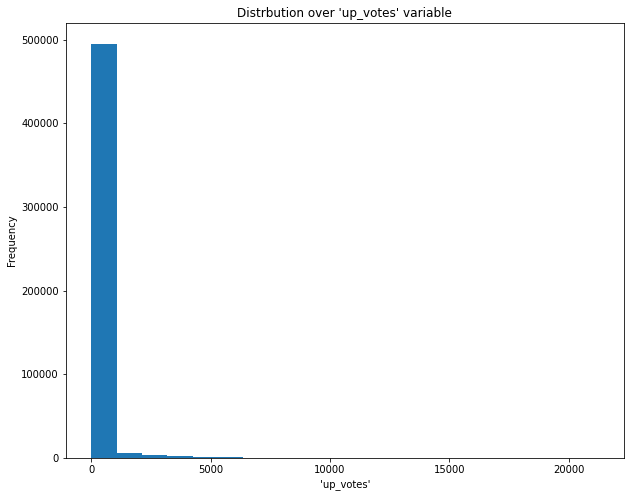
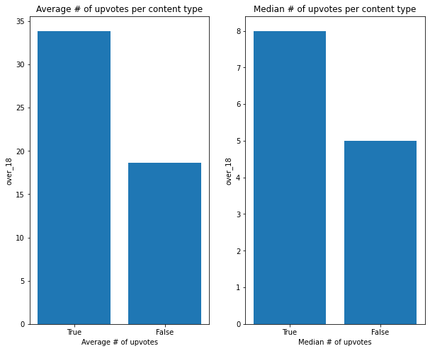
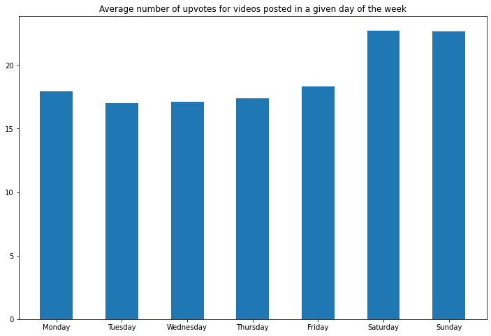
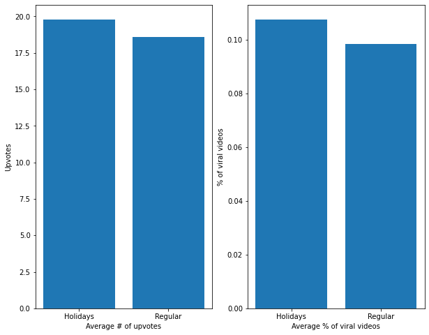
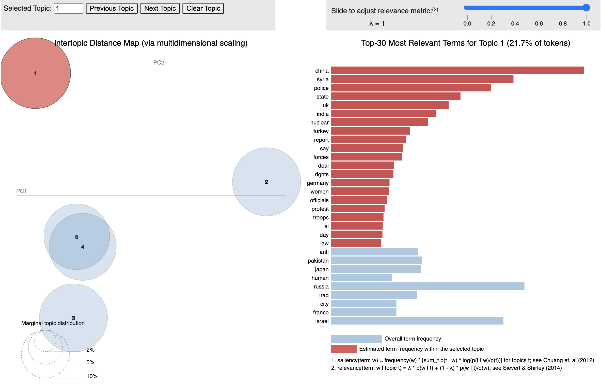
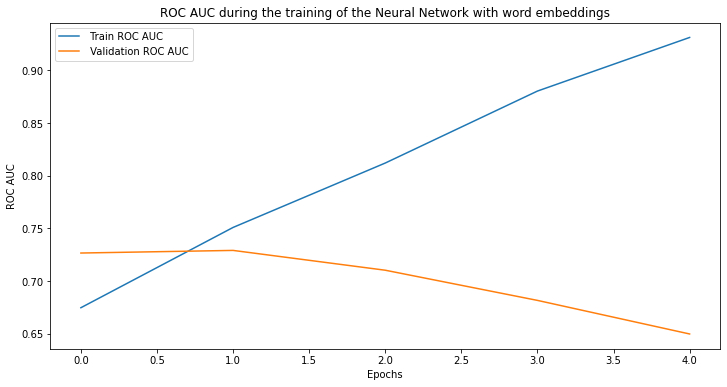
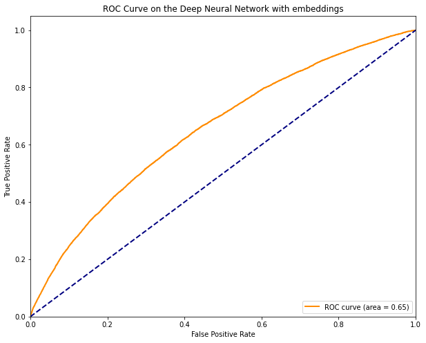
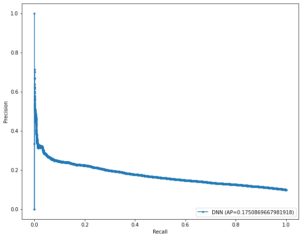
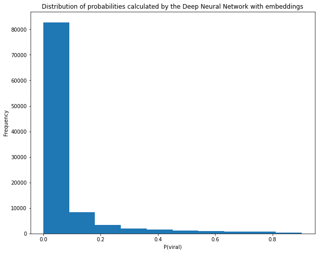

# Eluvio Data Science Challenge

<!-- TABLE OF CONTENTS -->

  
Table of Contents

  <ol>
    <li>
      <a href="#about-the-project">About The Project</a>
    </li>
    <li><a href="#exploratory-data-analysis">Exploratory Data Analysis</a></li>
    <li><a href="#topic-modeling">Topic Modeling</a></li>
    <li><a href="#sentiment-analysis">Sentiment Analysis</a></li>
    <li><a href="#predictive-modeling">Predictive Modeling</a>
      <ul>
        <li><a href="#Regression">Regression</a></li>
        <li><a href="#Classification">Classification</a></li>
      </ul>
    </li>
    <li><a href="#conclusions-and-recommendations">Conclusions and Recommendations</a></li>
    <li><a href="#contact">Contact</a></li>
  </ol>

<!-- ABOUT THE PROJECT -->
## About The Project

In this project, we are given a dataset with an open problem. The prompt asks us to define a business problem that can be solved with the data at hand, with a specific focus on NLP. The data is in the .csv format and can be found under [this link](https://drive.google.com/file/d/15X00ZWBjla7qGOIW33j8865QdF89IyAk/view?usp=sharing%5C). 

The problem that I decided to work on was a predictive modeling one. In particular, I explored both regression and classification problems. For the regression, I wanted to predict the number of up_votes that the video will get. For the classifiaction setting, I wanted to predict whether or not the video will get viral, where being viral is defined as having more than 100 up_votes. I focused more on the latter as I believed that it is a more valuable one from the business perspective.

<!--exploratory-data-analysis -->
## Exploratory Data Analysis

At the beginning, I wanted to understand the data better. These are the findings from this stage of the project:
- Distribution over up_votes follows power law distribution. Most of the content generates only a few upvotes. There are some pieces that attract more positive engagement, however only very few garnered virality and amassed an outstanding number of upvotes. In fact, 75th percentile on up_votes variable is equal to only 16 while the maximum is 21,253. 

- +18 content generates less upvotes 

- 1.5% of the most proliferate users (measured by the number of videos uploaded) generated 52.66% of content. Those most proliferate users receive more upvotes on average

- Videos posted on weekends and holidays receive more upvotes 
  

As a result of EDA, I created additional features for the predictive modeling algorithms.

<!--topic-modeling -->
## Topic Modeling

For this task, I used the Latent Dirichlet Allocation (LDA). LDA is an NLP algorithm for topic modelling. LDA assumes that each document can be represented as a mixture of topics and that each topic spits out random words with certain probabilities. For instance, a legal document might be 65% legal, 25% financial and 5% ethical. Within each of those topics, all of the words in english dictionary (or any other language for that matter) have a certain probability of getting drawn. Thus, the text is just a result of probabilistic random words generation. LDA strives to find such mixtures of topics and word probabilities within them so that the generation of a text similar to the one observed (in the training set) has the highest likelihood.

The LDA I designed for this project aimed to find 5 distinct topics. Given the fact that all of the videos from the dataset were from the 'worldnews' category, their topics were quite similar. Nonetheless, the model found topics that focus on particular regions, or on the less violent news. 

The results of the LDA where displayed with the use of pyLDAvis library, which creates an interactive widget that represents the topics and the similarity between them. A screenshot from the widget in jupyter notebook is pasted below. It represents the map of topics on the left side and the distriiibution of the most frequent words in that topic on the right side.

<!--sentiment-analysis -->
## Sentiment Analysis
Another NLP task that might advance Eluvio's pursuit of business objectives is sentiment analysis. At its very basic, the company might use text classification to understand whether users prefer a positively or negatively charged content. Such a use case of sentiment analysis will be presented here. In general, Eluvio might want to go further and, for instance, investigate whether radical titles attract more traffic. If that is the case, the company might want to monitor the radical content (after initially classifying it as such using NLP) to prevent harmful, hateful, or distasteful videos from going viral.

The data that we were given was unlabeled for the sentiment analysis purpose. Given the magnitude of the data, it was impossible to label it by hand. Because of that, I resorted to pre-trained sentiment analysis models. In particular, I used the huggingface's library called 'transformers'. To see if the pre-trained models deliver any valuable insight when applied to oour data, I ran a simple sanity check: I randomly chose some texts and observed how different models predict on them. Based on that, I eliminated models that make very wrong predictions. I was left with 2 models. To account for the situations where the predicted sentiments are at a disagreement, I divided the values where this is the case by 2 so that the final labels were; {anonymous negative: -1, disputed negative: -0.5, disputed positive: 0.5, anonymous positive: 1}. 

These values were used as predictors in our regression and classification models.

<!--predictive-modeling -->
## Predictive Modeling

For the regression problem, I used Linear Regression, Gradient Boosted Trees (as a better alternatve to vanilla Random Forests), and Neural Networks. For the classifcation, I used the equivalents of those algorithms, namely the Logistic Regression, Gradient Boosted Trees, and Neural Networks, and added the Linear Discriminant Analysis. Some other popular algorithms are omited on purpose, mainly due to time limitations and, to some extent, my own preferences and beliefs or lack thereof in certain models. For instance, Support Vector Machines could yield a nice result, especially with a non-linear kernel, such as RBF. However, SVMs' training time complexity is awful. The training scales in $O(N^3)$ , which on our dataset of +500.000 rows would at best take multiple hours to converge. Similarly, Random Forests were omitted, as in my experience they usually perform very similarly to, but also slightly worse than the GBT.

I first divided the dataset into three groups: train, validation, and test sets. I trained all of the models on the train set and tracked their performance on unseen data with the use of the validation set. After the best model was obtained, I checked its performance on the test set to get an estimate of how the model would perform in practice. Such a method is needed so that we do not overfit by optimizing the hyperparameters with respect to the validation set. The results of the models are presented below.

### Regression

| Model | MSE    |
|-------|--------|
| LR    | 963.52 |
| GBT   | 963.07 |
| DNN   | 958.59 |

As we can see, the Deep Neural Network performed the best. The mean squared error was still high, however.

### Classification

For the classification problem, I decided to enrich the best performing model, DNN, with word embeddings. The structure of Neural Networks allows for it and my hypothesis that the information hidden in the video titles will be a valuable one for the prediction of whether or not the video will croo the threshold of 100 upvotes. On all of the metrics of interest, the performance of DNN with embeddings is significantly better than that of the remaining models. 

I chose F1 score to be the main metric of interest for this problem. This is because the data was highly unbalanced (~10% of positive samples) and thus the model could maximize on some metrics by being completely ignorant and labeling all of the samples as negatives. 

The table below shows the metrics at the threshold that maximizes the F1 score. The values for the DNN with embeddings are obtained on the test set.

| Model               | F1 Score | Accuracy | Precision | ROC AUC | P-R AUC |
|---------------------|----------|----------|-----------|---------|---------|
| LR                  | 0.184    | 0.405    | 0.106     | 0.552   | 0.12    |
| LDA                 | 0.184    | 0.432    | 0.107     | 0.552   | 0.12    |
| GBT                 | 0.188    | 0.408    | 0.109     | 0.559   | 0.12    |
| DNN                 | 0.199    | 0.501    | 0.118     | 0.591   | 0.132   |
| DNN with embeddings | 0.246    | 0.739    | 0.172     | 0.654   | 0.175   |

The following graphs were produced for all the models, but here, I only present them for the best-performing DNN with embeddings. 

<!--conclusions-and-recommendations -->
## Conclusions and Recommendations

Based on the combination of EDA, feature engineering, topic modeling, and sentiment analysis, we were able to create ddecent predictive models both in the regression, and classification settings. Especially the results obtained on the classification problem are satisfying, as they showed that a skillful incorporation of NLP techniques in combination with numerical features, can lead to a significant improvement in the performance of predictive ML models. At the threshold maximizing F1 score, the model was able to correctly classify 43% of all the posts that went viral. At the same threshold, out of all the negative samples, 77% was labeled as such. These are satisfying results that could indeed improve the business intelligence of Eluvio. For instance, with a reasonably good ability to identify the videos that have a high likelihood of going viral, the company can monitor them more closely so that to avoid harmful content reaching multiple users. 

Even though the dataset we werre given was limited in scope, there still remain a lot of business questions that stand unanswered. A couple of ideas for a further exploration of this dataset (potentially enriched with other data) are listed below:
- Predicting whether or not the content should be labeled as 18+. There might be some videos that are drastic but weren't labeled as such by their creators. If we could come up with an algorithm that detects the content that should be 18+, we could probably improve the customer satsfaction and reduce the risk.
- Using Recurrent Neural Networks to generate the titles for videos of a certain topic so that the user engagement with the video (measured in upvotes) is maximized. This could help the content creators to reach more users, which would nudge them to create even more content, thus attracting even more new users.
- Analyzing whether or not the content creator is likely to become a 'proliferate' creator. If we had an algorithm like that, we could try to support those most promising creators in growing their audiences.

<!-- contact -->
## Contact

Jakub Warmuz - kuba.warmuz@minerva.kgi.edu
